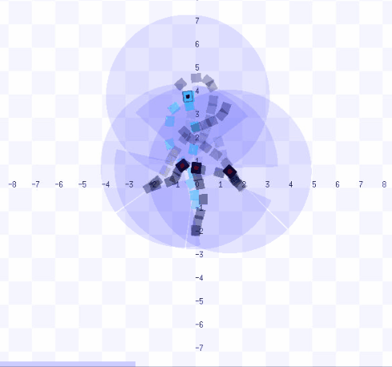
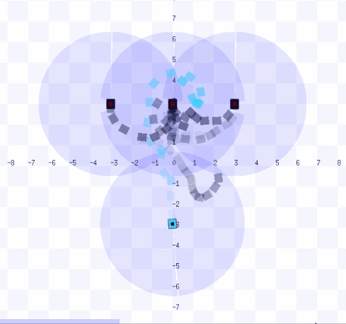
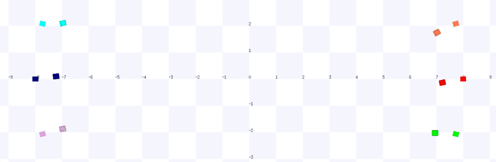
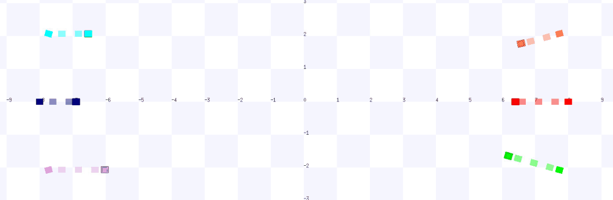
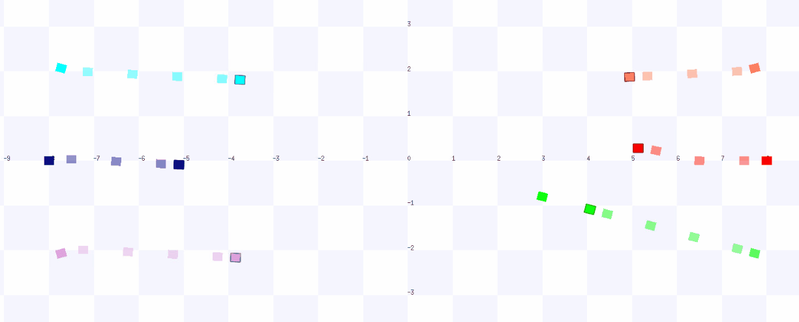

# collision-free navigation via Markov Games

This is a Pytorch implementation of the paper [Collision-free Navigation of Human-centered Robots via Markov Games](doc/paper.pdf)

## Requirement

- python2.7
- [ROS Melodic](http://wiki.ros.org/melodic)
- [mpi4py](https://mpi4py.readthedocs.io/en/stable/)
- [Stage](http://rtv.github.io/Stage/)
- [PyTorch](http://pytorch.org/)

## installing notes  

Please use the `stage_ros-add_pose_and_crash` package instead of the default package provided by ROS. 
```
mkdir -p catkin_ws/src
cp stage_ros-add_pose_and_crash catkin_ws/src
cd catkin_ws
catkin_make
source devel/setup.bash
```

Please export the following path name instead of the name in Stage installing page 
```
export LD_LIBRARY_PATH=path to stage
```

## arguments 


## How to test in adversarial scenarios

### launch stage (stage_utils) 

specify the number, rosport in the launch_stage.py  
```
python launch_terminals.py 
```

### run adversaries

specify the melliciousness of the adversaries through the arguments 
```
mpiexec.openmpi --allow-run-as-root -np 3 python ppo_ad_general.py  --scenarios 0 --rosports 11336 --robotIds 1 2 3 --fileIds 1009 --modelEps 1400 --train 0 --speedBound 1.0 1.0 --stdBound 1.0 1.0 --funIndex 0    
mpiexec.openmpi --allow-run-as-root -np 3 python ppo_ad_general.py  --scenarios 1 --rosports 11337 --robotIds 1 2 3 --fileIds 1010 --modelEps 3380 --train 0 --speedBound 1.0 1.0 --stdBound 0.5 0.5 --funIndex 0
mpiexec.openmpi --allow-run-as-root -np 3 python ppo_ad_general.p --scenarios 2 --rosports 11338 --robotIds 1 2 3 --fileIds 1011 --modelEps 3380 --train 0 --speedBound 1.0 1.0 --stdBound 0.8 0.8 --funIndex 0  
```

### load model and test

specify the loaded model and goals 
```
mpiexec.openmpi --allow-run-as-root -np 3 python ppo_ag_general_testV2.py  --scenarios 4 5 4 --rosports 11336 11337 11338 --robotIds 0 0 0 --fileIds 41 --modelEps 2320  
```   
  |     |  
:-------------------------:|:-------------------------:  |:-------------------------:


## how to test in non-adversaries scenrios 

### launch stage simulator(stage_utils)

launch the stage of stage3.world
```
python launch_terminals.py
```

### launch methods

our methos(pf-discrete)
```
mpiexec.openmpi --allow-run-as-root -np 6 python ppo_ag_general_ttV2.py  --scenarios 3 3 3 3 3 3 --rosports 11336 11336 11336 11336 11336 11336 --robotIds 0 1 2 3 4 5 --fileIds 41 --modelEps 2320  
```
 
:-------------------------:

drlmaca
```
mpiexec.openmpi --allow-run-as-root -np 6 python ppo_ag_general_ttV2.py  --scenarios 3 3 3 3 3 3 --rosports 11336 11336 11336 11336 11336 11336 --robotIds 0 1 2 3 4 5 --fileIds 77777 --modelEps 780     
```
 
:-------------------------:


orca
```
mpiexec.openmpi --allow-run-as-root -np 6 python orca_stage_noAd.py    
```
 
:-------------------------:

cadrl
```
mpiexec.openmpi --allow-run-as-root -np 6  python cadrl_stage_noAd.py    
```
 
:-------------------------:


## How to train in multi-scenarios 
### current workspace        
```   
mpiexec --allow-run-as-root -np 48 python ppo_stage1.py    
```   
###  Sim_gazebo(rl_ws) workspace    
```   
roscore -p 11312    
rosrun stage_ros_add_pose_and_crash stageros ../../../home/long_ws/rl-clision-avoidance/worlds/stage_map7.world   
roscore -p 11313   
rosrun stage_ros_add_pose_and_crash stageros ../../../home/long_ws/rl-clision-avoidance/worlds/stage_map8.world   
roscore -p 11314    
rosrun stage_ros_add_pose_and_crash stageros ../../../home/long_ws/rl-clision-avoidance/worlds/stage_map9.world   
roscore -p 11315    
rosrun stage_ros_add_pose_and_crash stageros ../../../home/long_ws/rl-clision-avoidance/worlds/stage_map10.world   
roscore -p 11316    
rosrun stage_ros_add_pose_and_crash stageros ../../../home/long_ws/rl-clision-avoidance/worlds/stage_map11.world   
roscore -p 11317    
rosrun stage_ros_add_pose_and_crash stageros ../../../home/long_ws/rl-clision-avoidance/worlds/stage_map12.world   
```   

:-------------------------:


## How to do adversarial training 
### command for runing adversarial in stage       
  

:-------------------------:

## How to train in gazebo and stage  
```   
export ROS_MASTER_URI=http://localhost:11413     
roslaunch turtlebot3_autorl turtlebot3_office_envRL1.launch gui:=true    
roscore -p 11412      
rosrun stage_ros_add_pose_and_crash stageros ../../../home/long_ws/rl-collision-avoidance/worlds/stage1.world     
mpiexec --allow-run-as-root -np 25 python ppo_stage_gazebo.py      
```   

:-------------------------:    


