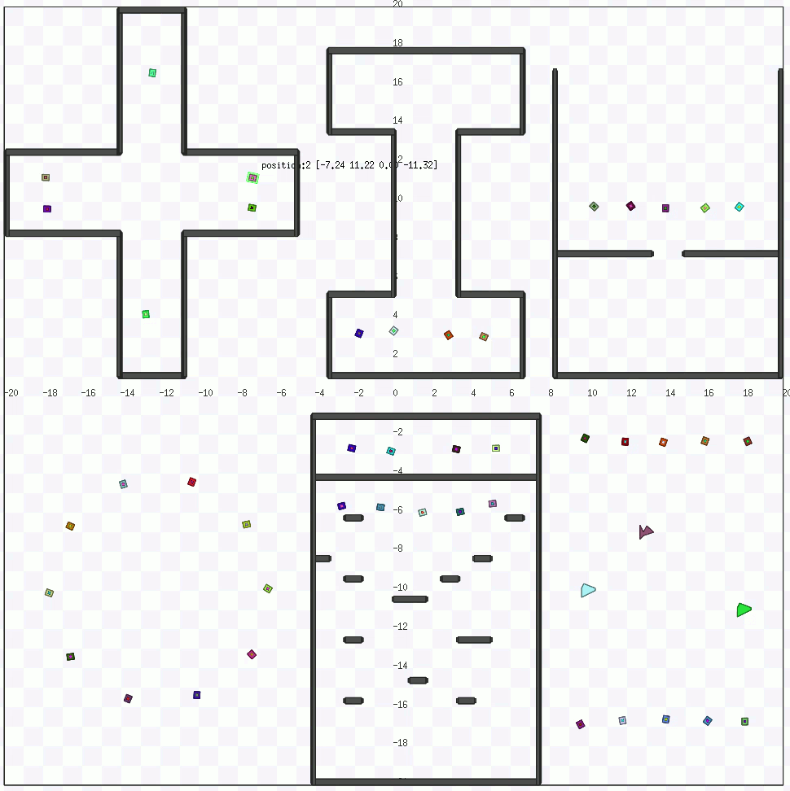

# rl-collision-avoidance

This is a Pytorch implementation of the paper [Towards Optimally Decentralized Multi-Robot Collision Avoidance via Deep Reinforcement Learning](https://arxiv.org/abs/1709.10082)

<!--   |  
:-------------------------:|:-------------------------:  -->

## Requirement

- python2.7
- [ROS Kinetic](http://wiki.ros.org/kinetic)
- [mpi4py](https://mpi4py.readthedocs.io/en/stable/)
- [Stage](http://rtv.github.io/Stage/)
- [PyTorch](http://pytorch.org/)


## How to train
Please use the `stage_ros-add_pose_and_crash` package instead of the default package provided by ROS.
```
mkdir -p catkin_ws/src
cp stage_ros-add_pose_and_crash catkin_ws/src
cd catkin_ws
catkin_make
source devel/setup.bash
```

To train Stage1, modify the hyper-parameters in `ppo_stage1.py` as you like, and running the following command:
```
rosrun stage_ros_add_pose_and_crash stageros -g worlds/stage1.world
mpiexec -np 24 python ppo_stage1.py
```
To train Stage2, modify the hyper-parameters in `ppo_stage2.py` as you like, and running the following command:
```
rosrun stage_ros_add_pose_and_crash stageros -g worlds/stage2.world
mpiexec -np 44 python ppo_stage2.py
```
## How to test

```
rosrun stage_ros_add_pose_and_crash stageros worlds/circle.world
mpiexec -np 50 python circle_test.py
```   

## installing problem  
export LD_LIBRARY_PATH=path to stage

## How to train in multi-scenarios 
### current workspace        
```   
mpiexec --allow-run-as-root -np 48 python ppo_stage1.py    
```   
###  Sim_gazebo(rl_ws) workspace    
```   
roscore -p 11312    
rosrun stage_ros_add_pose_and_crash stageros ../../../home/long_ws/rl-clision-avoidance/worlds/stage_map7.world   
roscore -p 11313   
rosrun stage_ros_add_pose_and_crash stageros ../../../home/long_ws/rl-clision-avoidance/worlds/stage_map8.world   
roscore -p 11314    
rosrun stage_ros_add_pose_and_crash stageros ../../../home/long_ws/rl-clision-avoidance/worlds/stage_map9.world   
roscore -p 11315    
rosrun stage_ros_add_pose_and_crash stageros ../../../home/long_ws/rl-clision-avoidance/worlds/stage_map10.world   
roscore -p 11316    
rosrun stage_ros_add_pose_and_crash stageros ../../../home/long_ws/rl-clision-avoidance/worlds/stage_map11.world   
roscore -p 11317    
rosrun stage_ros_add_pose_and_crash stageros ../../../home/long_ws/rl-clision-avoidance/worlds/stage_map12.world   
```   

:-------------------------:

## How to do adversarial training 
### command for runing adversarial in stage   
```  
roscore -p 11323     
rosrun stage_ros_add_pose_and_crash stageros ../../../home/long_ws/rl-collision-avoidance/worlds/stage_adMap2.world   
roscore -p 11324    
rosrun stage_ros_add_pose_and_crash stageros ../../../home/long_ws/rl-collision-avoidance/worlds/stage_adMap3.world    
roscore -p 11325    
rosrun stage_ros_add_pose_and_crash stageros ../../../home/long_ws/rl-collision-avoidance/worlds/stage_adMap4.world    
mpiexec --allow-run-as-root -np 3 python ppo_ad_chaseV2.py     
mpiexec --allow-run-as-root -np 3 python ppo_ad_push.py    
mpiexec --allow-run-as-root -np 3 python ppo_ad_notPass.py   
```    
### command for testing cadrl in stage(cadrl_ros/script)    
```  
mpiexec --allow-run-as-root -np 3 python cadrl_stage.py     
```   
### command for testing orca in stage(pyorca_ros/test.py)    
```  
mpiexec --allow-run-as-root -np 3 python test.py     
```   
### comand fot training agents in adversarial scenarios   
```   
mpiexec --allow-run-as-root -np 3 python ppo_ag_general.py     
mpiexec --allow-run-as-root -np 3 python ppo_ag_general_testV2.py     
```    

:-------------------------:

## How to train in gazebo and stage  
```   
export ROS_MASTER_URI=http://localhost:11413     
roslaunch turtlebot3_autorl turtlebot3_office_envRL1.launch gui:=true    
roscore -p 11412      
rosrun stage_ros_add_pose_and_crash stageros ../../../home/long_ws/rl-collision-avoidance/worlds/stage1.world     
mpiexec --allow-run-as-root -np 25 python ppo_stage_gazebo.py      
```   

:-------------------------:    

## New command for training    
### protagonist:   
```   
mpiexec.openmpi --allow-run-as-root -np 3 python ppo_ag_general.py  --scenario 0 0 0 --rosports 11333 11336 11339  --robotIds 0 0 0  --fileId 0 
mpiexec.openmpi --allow-run-as-root -np 3 python ppo_ag_general.py  --scenario 1 1 1 --rosports 11334 11337 11340  --robotIds 0 0 0  --fileId 1 
mpiexec.openmpi --allow-run-as-root -np 3 python ppo_ag_general.py  --scenario 2 2 2 --rosports 11335 11338 11341  --robotIds 0 0 0  --fileId 2   
```    
### adversaries:  
```   
mpiexec.openmpi --allow-run-as-root -np 9 python ppo_ad_general.py  --scenario 0 0 0 0 0 0 0 0 0 --rosports 11333 11333 11333  11336 11336 11336 11339 11339 11339 --robotIds 1 2 3 1 2 3 1 2 3  --fileId 1000
mpiexec.openmpi --allow-run-as-root -np 9 python ppo_ad_general.py  --scenario 1 1 1 1 1 1 1 1 1 --rosports 11334 11334 11334 11337 11337 11337 11340 11340 11340 --robotIds 1 2 3 1 2 3 1 2 3  --fileId 1001 
mpiexec.openmpi --allow-run-as-root -np 9 python ppo_ad_general.py  --scenario 2 2 2 2 2 2 2 2 2 --rosports 11335 11335 11335 11338 11338 11338 11341 11341 11341 --robotIds 1 2 3 1 2 3 1 2 3  --fileId 1002   
```   